

 

 

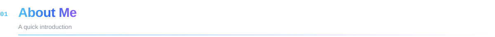

<table>
<tr>
<td width="56%" valign="top">

Hi, I'm **Imesh** 👋 — a full stack software engineer from **Sri Lanka 🇱🇰** who loves turning ideas into fast, reliable and beautifully designed products.

- 💼 &nbsp;**Trainee Software Engineer** at **Synergy Information System**
- 🔭 &nbsp;Building **monitoring, analytics & reporting** platforms
- 🌱 &nbsp;Learning **Advanced Java · Laravel · Microservices**
- 🎯 &nbsp;Goal: ship high-performance apps for a global audience
- ⚡ &nbsp;I debug with coffee ☕ and deploy with confidence 🚀

</td>
<td width="44%" valign="top">

**🎓 Education**

**BSc (Hons) in Information Technology** 
SLIIT · Undergraduate

**Professional Development Course** 
University of Moratuwa

**Diploma in IT — Distinction** 
ICBT Campus

</td>
</tr>
</table>

 

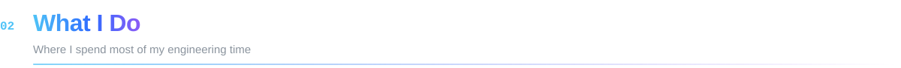

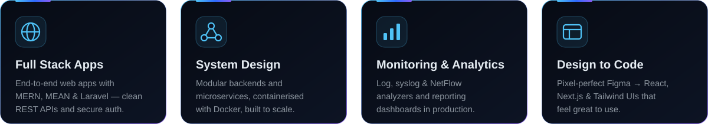

  

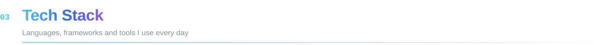

| | |
|:--|:--|
| **Languages** |  |
| **Frontend** |  |
| **Backend** |  |
| **Data** |  |
| **DevOps & Tools** |  |

 

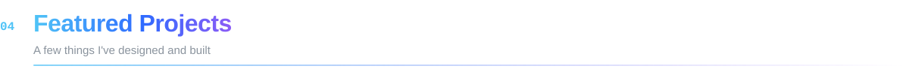

<a href="https://github.com/Imesh-Bandar/The-NextStep-Platform">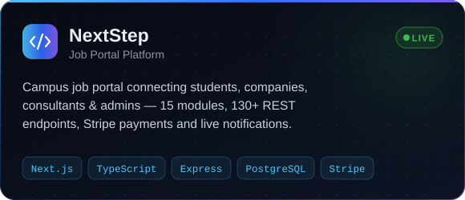</a>
<a href="https://github.com/Imesh-Bandar/Tourvana">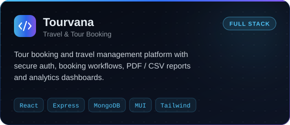</a>
 
<a href="https://github.com/Imesh-Bandar/Advance-Authentication-System">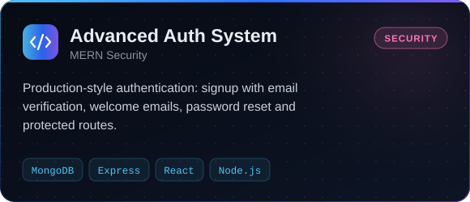</a>
<a href="https://github.com/Imesh-Bandar/-SmartNotes-MERN">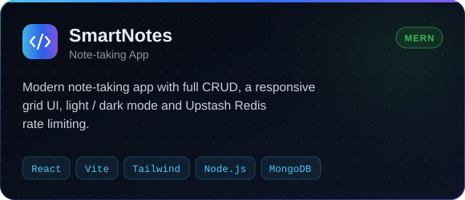</a>
 
<a href="https://github.com/Imesh-Bandar/React-Employe-Management-System">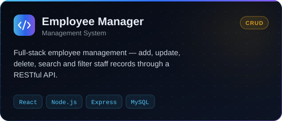</a>
<a href="https://github.com/Imesh-Bandar/ORBIT">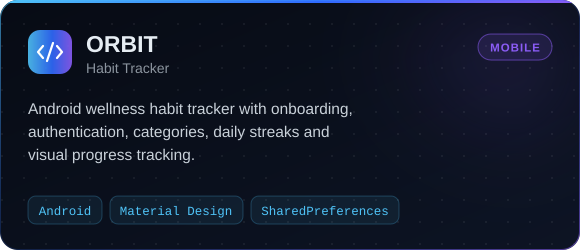</a>
 

 

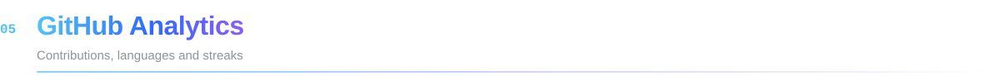

 

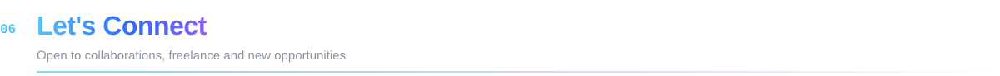

**Have a project, an idea or an opportunity? I'd love to hear about it.**

  

